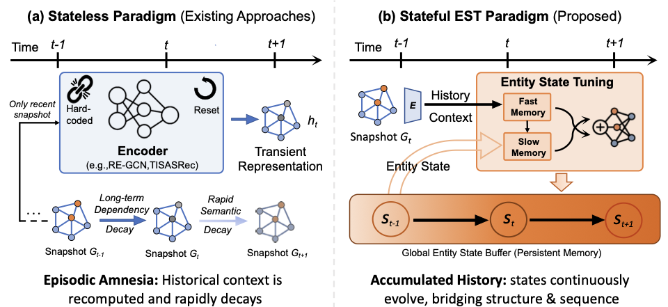

# Evolving Beyond Snapshots: Harmonizing Structure and Sequence via Entity State Tuning for Temporal Knowledge Graph Forecasting

This repository contains the official implementation of *Evolving Beyond Snapshots: Harmonizing Structure and Sequence via Entity State Tuning for Temporal Knowledge Graph Forecasting*.

Paper: https://arxiv.org/abs/2602.12389

## Overview

EST is a temporal knowledge graph forecasting framework for tail prediction on queries of the form `(s, r, ?, t)`. The model combines structural context, temporal sequence modeling, and persistent entity-state updates within a unified training pipeline.

Key features:

- Persistent entity-state memory instead of snapshot-wise reconstruction.
- Pluggable temporal backbones: `transformer`, `mamba`, `lstm`, `rnn`.
- Optional structural encoder for historical neighbor modeling.
- Time-aware negative filtering during training.

## Framework



The framework contrasts stateless temporal reasoning with EST's stateful design, where entity states are maintained and updated over time to couple structural evidence with temporal dynamics.

## Installation

```bash
pip install -r requirements.txt
```

## Training

Run from the repository root:

```bash
python code/main.py \
  --data_dir ./data \
  --dataset ICEWS14 \
  --temporal_encoder transformer \
  --epoch 20 \
  --batch_size 128
```

Recommended baseline:

```bash
python code/main.py \
  --data_dir ./data \
  --dataset ICEWS14 \
  --temporal_encoder transformer \
  --epoch 20 \
  --batch_size 128 \
  --dim 64 \
  --time_emb_dim 32 \
  --history_len 32 \
  --lr 5e-3 \
  --l2 1e-4
```

Common variants:

```bash
python code/main.py --data_dir ./data --dataset ICEWS14 --no_cuda
python code/main.py --data_dir ./data --dataset ICEWS14 --temporal_encoder lstm
python code/main.py --data_dir ./data --dataset ICEWS14 --temporal_encoder mamba
python code/main.py --data_dir ./data --dataset ICEWS14 --no_struct_encoder
python code/main.py --data_dir ./data --dataset ICEWS14 --no_time_aware_negative
```

## Repository Structure

```text
.
├── code/
│   ├── main.py                  # training entry point
│   ├── data_loader.py           # dataset loading and temporal neighbor retrieval
│   ├── train.py                 # training and evaluation loop
│   └── models/
│       ├── est.py               # EST model
│       ├── temporal_encoders.py # Transformer / Mamba / LSTM / RNN backbones
│       ├── struct_encoder.py    # structural encoders
│       └── time.py              # time encoding utilities
├── data/
│   ├── ICEWS14/
│   ├── ICEWS18/
│   ├── ICEWS05-15/
│   └── GDELT/
└── requirements.txt
```

## Citation

```bibtex
@article{li2026evolving,
  title={Evolving Beyond Snapshots: Harmonizing Structure and Sequence via Entity State Tuning for Temporal Knowledge Graph Forecasting},
  author={Li, Siyuan and Wu, Yunjia and Xiao, Yiyong and Huang, Pingyang and Li, Peize and Liu, Ruitong and Wen, Yan and Sun, Te and Pei, Fangyi},
  journal={arXiv preprint arXiv:2602.12389},
  year={2026}
}
```
